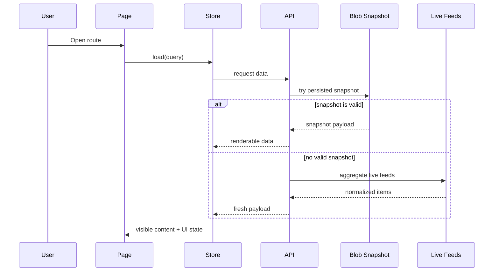

# Architecture and Data Flow

This document explains the essential moving parts of Front Page News without going into every implementation detail.

## Application layers

```text
src/app/     UI, routes, stores, components, adapters
src/lib/     shared frontend helpers and API-facing contracts
api/         Vercel serverless entry points
server/      feed parsing, aggregation, snapshot generation logic
shared/      contracts reused across browser and server
```

## Frontend structure

### Pages

- `home-page.component.ts`
  - editorial home composition
- `section-page.component.ts`
  - section-specific results with source filters
- `source-page.component.ts`
  - publisher-specific results with section filters
- `search-page.component.ts`
  - search results page

### Stores

- `NewsStore`
  - owns loading, visible content, stale state, refresh state, and user-facing freshness signals
- `SourcesStore`
  - owns source catalog loading and error state

### UI composition

- Layout components manage navbar, sticky header, footer, and page container.
- News components render cards, carousels, lists, filters, modals, and empty/error states.
- Utility modules normalize route slugs, labels, search queries, and API-to-UI mapping.

## Data flow



## Why source pages matter

Source pages are one of the strongest product-specific views in the app:

- they convert any source click into a real navigation path
- they group all available news for one publisher
- they allow section-level filtering inside that publisher scope

This makes the source name more than a label: it becomes a secondary navigation axis alongside sections and search.

## Why the quick-view modal exists

The app does not try to replicate a full article page for every story. Instead:

- the modal gives fast context
- the user can decide whether the story is worth opening
- the final article remains on the original publisher site

That keeps the product aligned with feed aggregation rather than article mirroring.

## UI state model

Pages generally work with the same practical states:

- loading
- empty
- total error
- renderable content
- renderable stale content with background refresh

The important design decision is that renderable content wins over destructive loading resets whenever possible.

## Related deep dives

- [cache-and-ui-states.md](./cache-and-ui-states.md)
- [product-scope.md](./product-scope.md)
