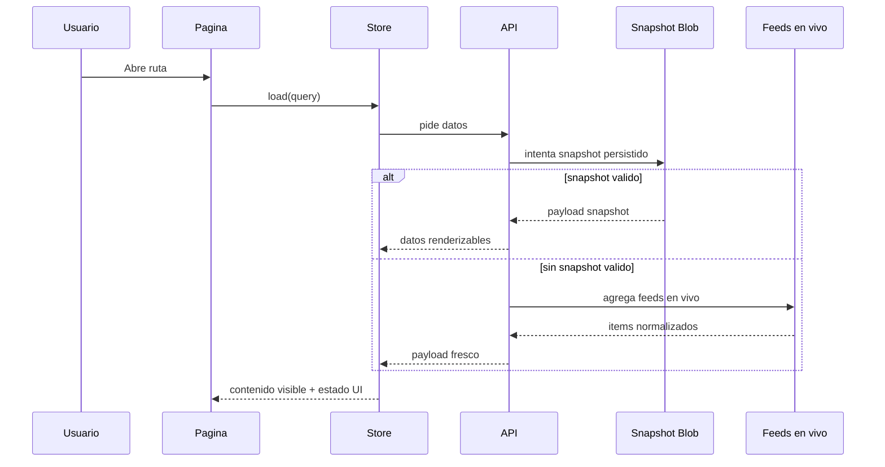

# Arquitectura y flujo de datos

Este documento explica las piezas esenciales de Front Page News sin entrar en cada detalle de implementacion.

## Capas de la aplicacion

```text
src/app/     UI, rutas, stores, componentes y adapters
src/lib/     utilidades compartidas del lado frontend
api/         entradas serverless de Vercel
server/      parseo de feeds, agregacion y generacion de snapshots
shared/      contratos reutilizados entre navegador y servidor
```

## Estructura frontend

### Paginas

- `home-page.component.ts`
- `section-page.component.ts`
- `source-page.component.ts`
- `search-page.component.ts`

### Stores

- `NewsStore`
  - controla carga, contenido visible, stale state, refresh state y senales de frescura
- `SourcesStore`
  - controla la carga del catalogo de medios y su error state

### Composicion UI

- Los componentes de layout gestionan navbar, sticky header, footer y page container.
- Los componentes de noticias renderizan cards, carruseles, listados, filtros, modales y estados vacios o de error.
- Las utilidades normalizan slugs, etiquetas, queries y adaptacion API-UI.

## Flujo de datos



## Por que importan las paginas de medio

- convierten cualquier click en un medio en una navegacion real
- agrupan noticias de un publisher concreto
- permiten filtrar por seccion dentro de ese medio

## Por que existe el quick-view modal

- da contexto rapido
- evita navegar a una pagina intermedia innecesaria
- mantiene la lectura final en la web del medio original

## Modelo de estados UI

Las paginas suelen trabajar con estos estados:

- loading
- empty
- error total
- contenido renderizable
- contenido stale renderizable con refresh en segundo plano

La decision principal es que el contenido renderizable prevalezca sobre resets destructivos.
